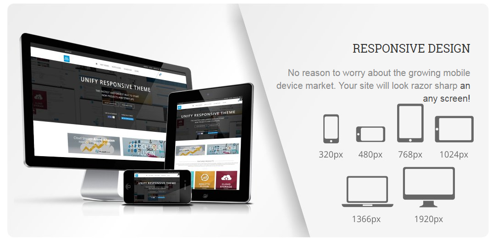
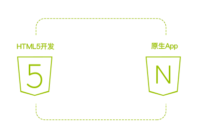
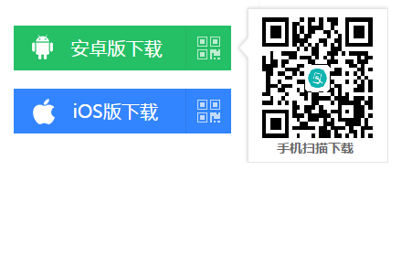
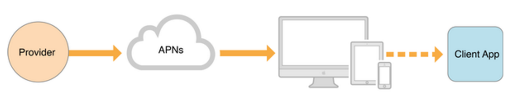
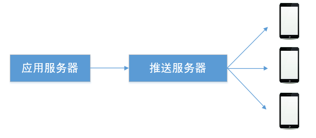
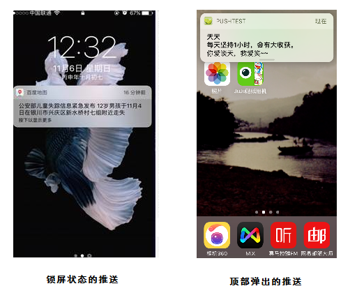
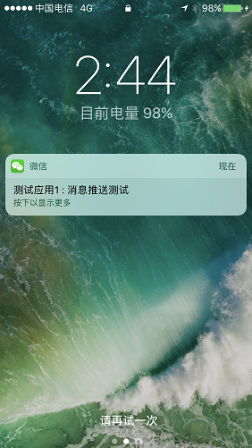
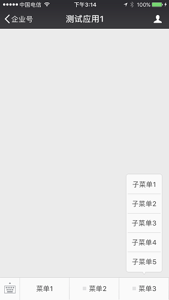

# 移动端开发
[1  手机web](#user-content-1--手机web)

　　[1.1  使用Html5开发手机 Web](#user-content-11--使用Html5开发手机 Web)

　　[1.2  自适应屏幕尺寸](#user-content-12--自适应屏幕尺寸)

[2  手机app](#user-content-2--手机app)

　　[2.1  手机web和手机app](#user-content-21--手机web和手机app)

　　[2.2  Hybrid开发模式](#user-content-22--Hybrid开发模式)

　　[2.3  Hybrid开发框架](#user-content-23--Hybrid开发框架)

　　[2.4  app安装与使用](#user-content-24--app安装与使用)

　　[2.5  消息推送](#user-content-25--消息推送)

　　　　[2.5.1  消息推送的原理](#user-content-251--消息推送的原理)

　　　　[2.5.2  消息推送的实现](#user-content-252--消息推送的实现)

[3  微信企业号](#user-content-3--微信企业号)

　　[3.1  企业号功能](#user-content-31--企业号功能)

　　[3.2  企业号开发步骤](#user-content-32--企业号开发步骤)

　　[3.3  微信消息推送](#user-content-33--微信消息推送)

##  1  手机web

###  1.1  使用Html5开发手机 Web

 HTML5是HTML的最新标准，HTML5的草案于2008年发布，2014年10月29日，W3C(万维网联盟)宣布，经过接近8年的艰苦努力，该标准规范终于制定完成。HTML5的设计目的是为了在移动设备上支持多媒体。新的语法特征被引进以支持这一点，如video、audio和canvas 标记。

Html5支持更有效的连接工作效率，使得基于页面的实时聊天，更快速的网页体验，更优化的在线交流得到了实现。HTML5拥有更有效的服务器推送技术WebSocket，帮助我们实现服务器将数据“推送”到客户端的功能。Html5支持<video>和<audio>标签，支持网页端的视频、音频等多媒体功能，支持基于SVG、Canvas、WebGL及CSS3的3D功能。

与桌面浏览器不同的是，移动操作系统和浏览器随着手机的换代而不断升级。移动浏览器的不断升级，给HTML5在移动Web方向的发展提供源源不断的动力，移动Web应用的能力也渐渐逼近客户端应用。

Web App开发成本低，轻松实现跨平台，保证体验的一致性；同时，迭代更新更加容易，用户使用成本和门槛较低。但Web App目前的不足也十分明显，如浏览体验不如手机App、无法调用手机文件，无法使用手机系统功能等。

###  1.2  自适应屏幕尺寸

信息技术的快速发展及应用，导致越来越多的终端用户不再拘泥于使用PC机浏览访问网页，而是逐渐往智能手机、平板电脑方向发展，由于这些终端屏幕大小不一、分辨率也各不相同，如果浏览网页不能自适应，会给开发及维护带来极大不便，而通过响应式布局，可以很好解决这一问题。

移动设备更新速度频繁，手机厂商繁多，导致的问题是每一台机器的屏幕宽度和分辨率不一样。响应式布局，指的是一个网站能够兼容多个终端——而不是为每个终端做一个特定的版本。这个概念是为解决移动互联网浏览而诞生的。响应式布局可以为不同终端的用户提供更加舒适的界面和更好的用户体验，随着目前大屏幕移动设备的普及，响应式布局已成为大势所趋。

基于响应式布局实现的网页能够根据浏览终端的不同以及同一终端分辨率的不同自适应显示相应不同的网页效果，消除浏览终端，包括PC机、智能手机及平板电脑等对网页展示效果的影响，所以已经成为信息时代应用的主流。用户可以在电脑、手机、ipad上访问网站，系统采用响应式布局技术，兼容不同的屏幕尺寸和分辨率，自动调整页面布局。

##  2  手机app

###  2.1  手机web和手机app

| 事项   | 手机web                                    | 手机app                                    |
| ---- | ---------------------------------------- | ---------------------------------------- |
| 基本介绍 | 由移动设备的浏览器来支持，只要移动设备支持上网浏览网站基本上可以随时随地的打开网站查找自己需要的信息。 | 由智能移动设备的操作系统来支持，目前包括主流的安卓(Android)和苹果(IOS)操作系统。 |
| 优势   | 1、用户无需安装，输入URL即可访问，使用门槛较低。 2、开发费用比APP低。3、用户无须更新APP应用 | 1、可以封装很多文字、图片、视频、本地数据库等资料，有很好的操作体验，节省流量  2、可访问手机通讯录、相机、GPS等功能，所以在操作方便和功能应用上均具备很大的优势 |
| 劣势   | 1、对一些相对复杂的功能和交互的实现和用户体验不如app。2、无法推送消息 3、无法调用手机终端的硬件设备（语音、摄像头、短信、GPS、蓝牙、重力感应等） | 1、需要下载及安装后才可使用  2、开发成本高，需要维护安卓和ios两套代码版本。3、版本更新时需要重新手动下载 |

###  2.2  Hybrid开发模式

原生APP开发和HTML5技术是传统移动应用开发领域两个最火的技术，Hybrid App（混合模式移动应用）是指介于web app和原生app这两者之间的app，  兼具原生App良好用户交互体验的优势和Web App跨平台开发和低成本的优势。 Hybrid App主要以JS+Native两者相互调用 为主，从开发层面实现“一次开发，多处运行”的机制，成为真正适合跨平台的开发。目前已经有众多 Hybrid App开发成功应用，比如淘宝、百度、网易等知名移动应用，都是采用Hybrid App开发模式。 

- 开发人员使用HTML5语言，不采用原生语言（java或objective-c），但是却有所有原生应用的特性；
- 架构方案会和原生app有出入，基本由工具而定；
- 具有跨平台特性；
- 相对原生app，开发和维护更简单;

###  2.3  Hybrid开发框架

目前流行的Hybird App开发框架包括Cordova、APPCan、DCloud、ApiCloud、Wex5等。我们选择ApiCloud作为手机Hybrid App的开发框架。

ApiCloud是一个免费的app开发平台，开发人员编写一套HTML5代码，通过ApiCloud平台编译成安卓和iOS应用。ApiCloud框架对 native 控件进行封装，允许开发者使用 javascript/html 来描述和调用这些控件。使用ApiCloud框架，可以快速开发平台兼容的成熟app产品。

###  2.4  app安装与使用

将编译生成的apk文件（用于安卓手机）和ipa文件（用于iphone和ipad）发布在系统web服务器中，通过企业内部分发的方式来进行app的安装。用户只需使用手机或ipad扫描指定的二维码，即可下载安装软件(ios不需要越狱)。

###  2.5  消息推送

####  2.5.1  消息推送的原理

iOS 系统的推送（APNS，即 Apple Push Notification Service）依托一个或几个系统常驻进程运作，是全局的（接管所有应用的消息推送），所以可看作是独立于应用之外，而且是设备和苹果服务器之间的通讯，而非应用的提供商服务器。ios在系统级别有一个推送服务程序使用 5223 端口。使用这个端口的协议源于 Jabber 后来发展为 XMPP ，被用于 Gtalk 等 IM 软件中。ios的推送，可以理解为，苹果服务器朝手机后台挂的一个 IM 服务程序发送的消息，系统根据该 IM 消息识别告诉哪个 Apps 具体发生了什么事。

一条ios消息的推送，分为以下三个阶段：

第一阶段：应用程序把要发送的消息、目的iPhone的标识打包，发给APNS。 
第二阶段：APNS在自身的已注册Push服务的iPhone列表中，查找有相应标识的iPhone，并把消息发到iPhone。 
第三阶段：iPhone把发来的消息传递给相应的应用程序， 并且按照设定弹出Push通知。

安卓系统推送原理有所不同，安卓app是允许后台运行的，可以在安卓app与推送服务器建立长连接，通过长连接进行推送。

####  2.5.2  消息推送的实现

用户使用手机或ipad下载安装app后，会自动与推送服务器连接，并生成设备号device_token。用户登录系统时，会根据用户角色和权限，修改设备的群组。

应用系统需要发出推送时，将推送内容（例如报警信息）和推送接收群组发送到推送服务器，由推送服务器根据群组信息找到设备列表，将消息发送到手机设备上。

如果手机处于待机或锁屏状态，会发出提示声音，并出现横幅通知；如果手机处于打开状态，会在屏幕顶部弹出通知条。

##  3  微信企业号

###  3.1  企业号功能

微信企业号是微信推出的面向企业级市场的产品，依托于微信平台，建立在微信整体架构和关系链之上，为企业/组织服务的连接平台。

同一个营业执照可以注册5个企业号，每个企业号中可以绑定约30个企业应用。

微信企业号主要包括以下的功能：

- 消息推送

微信企业号以普通会话的行事存在，可以收发消息。用户使用微信关注企业号后，就可以在微信中收到企业应用的推送消息。

- 功能菜单

可以在企业号中自定义菜单。在每个企业应用中，可以最多创建三个一级菜单，每个一级菜单下面，可最多创建五个二级菜单。

点击菜单按钮后，可进行多种操作：

(1) 跳转至某个URL，在微信中浏览网页

(2) 发送一段消息

(3) 调起微信的扫一扫工具，扫描二维码，将扫码的结果传给业务服务器做处理

(3) 调起系统相机，完成拍照操作后，会将拍摄的相片发送给业务服务器做处理

###  3.2  企业号开发步骤

(1) 由客户申请微信企业号，员工关注该企业号

(2) 由客户在企业微信管理平台中，创建一个企业应用，将企业应用的Id和密钥等信息告知开发人员

(3) 由开发人员进行后续功能的开发

###  3.3  微信消息推送

应用系统需要发出推送时，将推送内容（例如报警信息）发送到微信公众平台，员工可以在微信中收到推送消息。

可以对接收信息的人员进行配置，不同人员会接收到不同类型的推送消息。

